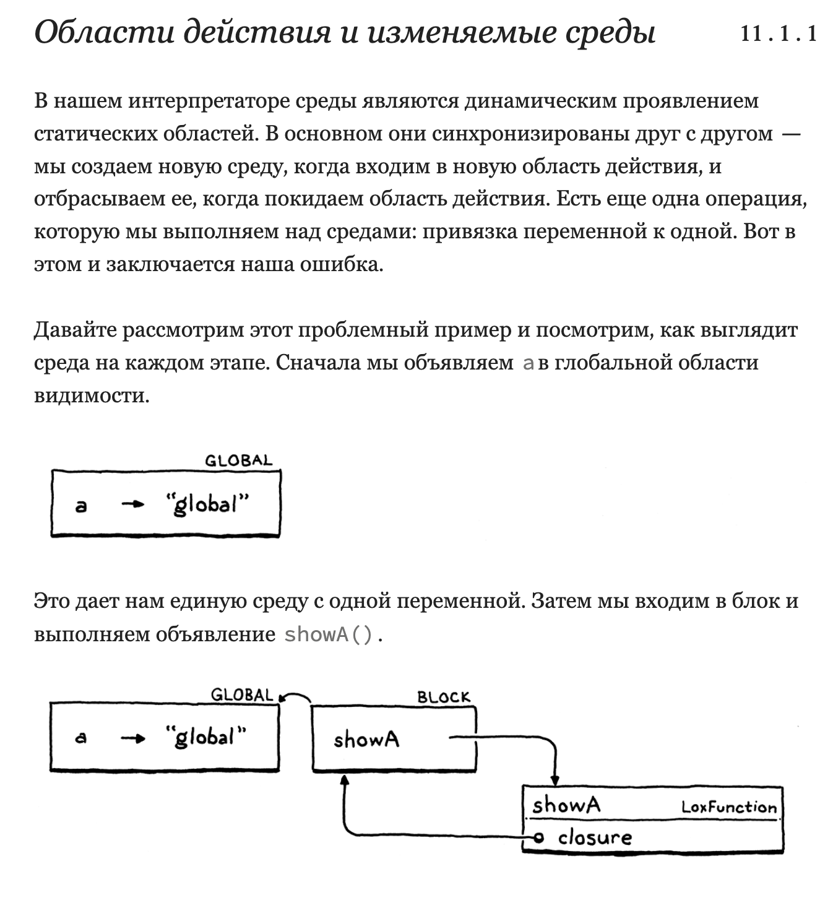
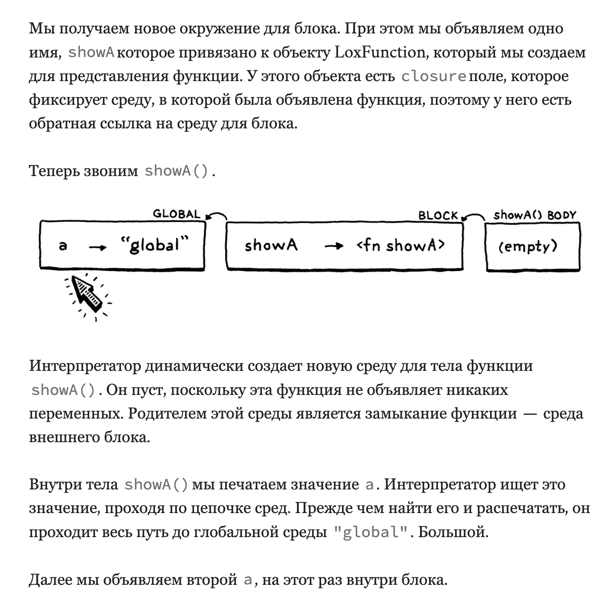
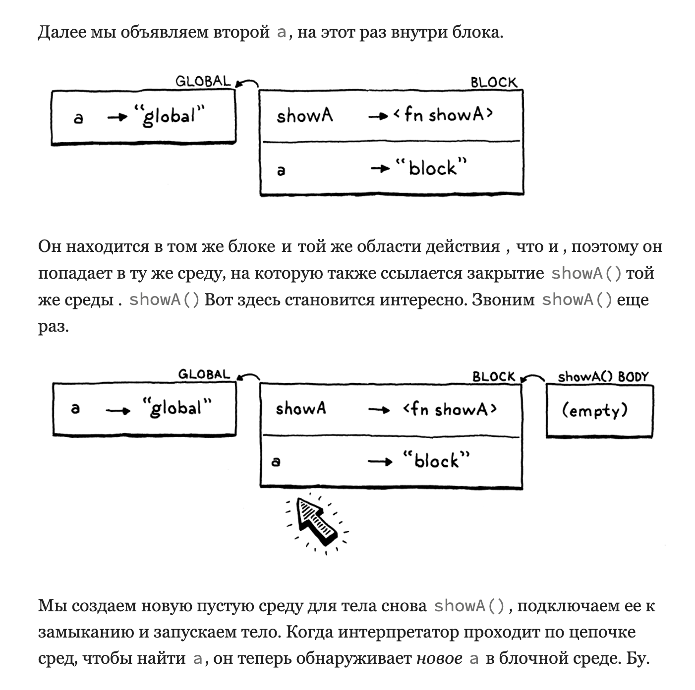

Решаем проблему с неправильным (динамическим) enviroment

var a = "global";
{
  fun showA() {
    print a;
  }

  showA();
  var a = "block";
  showA();
}

Выведет "global" и "block" ?!

img()
img()
img()

{
  var a;
  // 1.
  var b;
  // 2.
}

В первой отмеченной строке aнаходится только область видимости. На второй строчке оба aи bесть. Если вы определяете «область действия» как набор объявлений, то это явно не одна и та же область действия — они не содержат одни и те же объявления. Это похоже на то, что каждый varоператор разделяет блок на две отдельные области: область до объявления переменной и область после, которая включает новую переменную.

Но в нашей реализации среды действуют так, как будто весь блок представляет собой одну область действия, просто область действия, которая меняется со временем. Замыканиям это не нравится. Когда функция объявляется, она фиксирует ссылку на текущую среду. Функция должна сделать замороженный снимок среды в том виде, в котором она существовала на момент объявления функции . Но вместо этого в коде Java имеется ссылка на реальный изменяемый объект среды. Когда позже объявляется переменная в области, которой соответствует среда, замыкание видит новую переменную, даже если объявление не предшествует функции.

**Семантический анализ

Наш интерпретатор разрешает переменную — отслеживает, на какое объявление она ссылается — каждый раз, когда вычисляется выражение переменной. Если эта переменная помещена в цикл, который выполняется тысячу раз, эта переменная будет повторно разрешена тысячу раз.

Мы знаем, что статическая область видимости означает, что использование переменной всегда приводит к одному и тому же объявлению, что можно определить, просто взглянув на текст. Учитывая это, почему мы каждый раз делаем это динамически? Это не только открывает дыру, ведущую к нашей надоедливой ошибке, но и неоправданно медленно.

Лучшее решение — разрешить использование каждой переменной один раз . Напишите фрагмент кода, который проверяет программу пользователя, находит каждую упомянутую переменную и определяет, к какому объявлению каждая из них относится. Этот процесс является примером семантического анализа . Если синтаксический анализатор сообщает только о том, правильна ли программа ( синтаксический анализ), то семантический анализ идет дальше и начинает выяснять, что на самом деле означают части программы. В этом случае наш анализ разрешит привязки переменных. Мы будем знать не только то, что выражение является переменной, но и что это за переменная.

-----

 Если бы мы могли гарантировать, что поиск переменной всегда проходит по одному и тому же количеству ссылок в цепочке среды, это гарантировало бы, что каждый раз будет найдена одна и та же переменная в одной и той же области.

----

Решение 

1. 
После того как синтаксический анализатор создаст синтаксическое дерево, но до того, как интерпретатор начнет его выполнять, мы совершим один обход дерева, чтобы разрешить все содержащиеся в нем переменные. Дополнительные проходы между синтаксическим анализом и выполнением являются обычным явлением. 

- (Без побочных эффектов "print" and etc.)

- (Нет потока управления. Циклы посещаются только один раз . Обе ветки посещаются в ifвыписках. Логические операторы не замкнуты.)

**Проход с переменным разрешением

После того как синтаксический анализатор создаст синтаксическое дерево, но до того, как интерпретатор начнет его выполнять, мы совершим один обход дерева, чтобы разрешить все содержащиеся в нем переменные. Дополнительные проходы между синтаксическим анализом и выполнением являются обычным явлением. Если бы в Lox были статические типы, мы могли бы вставить туда средство проверки типов. Оптимизации часто реализуются отдельными проходами, подобными этому. По сути, таким способом можно выполнить любую работу, которая не зависит от состояния, доступного только во время выполнения.

Наш проход с переменным разрешением работает как своего рода мини-интерпретатор. Он обходит дерево, посещая каждый узел, но статический анализ отличается от динамического выполнения:

Побочных эффектов нет. Когда статический анализ обращается к оператору печати, он фактически ничего не печатает. Вызовы собственных функций или других операций, обращающихся к внешнему миру, блокируются и не оказывают никакого эффекта.

Нет потока управления. Циклы посещаются только один раз . Обе ветки посещаются в ifвыписках. Логические операторы не замкнуты.

----

Лишь несколько типов узлов представляют интерес, когда дело доходит до разрешения переменных:

Оператор блока вводит новую область действия для содержащихся в нем операторов.

Объявление функции вводит новую область действия для своего тела и связывает ее параметры в этой области.

Объявление переменной добавляет новую переменную в текущую область.

Для переменных и выражений присваивания необходимо разрешить их переменные.

----- 

В ИТОГЕ:

Resolver дефайнит все локальные пермеменные и привязывает переменные к каждомы Expression: VariableExpr или AssignExpr
чтобы понять что есть только эти локальные перменные и они используются + чтобы оптимизировать поиск в Enviroment классе
для рекурсивного выхода на нужный уровень. (Так как логика посещения узлов Interpretator и Resolver одинакова расстояния будут одинаковыми)

Отлавливает ошибки использования перменной до ее инициализации (возможна она и была объявлена но еще не инициализована Expr значением).